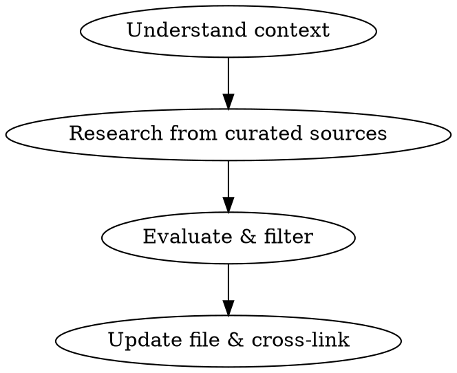

# Baby Research

Evidence-based research skill: curated sources, situation filtering, Oster evidence framework.

## Process



## Step 1: Understand Context

Read the project's `CLAUDE.md` for the user's profile, constraints, and preferences. Read the target file completely. Read any cross-linked files that affect this topic.

From these, build a picture of:
- **Situation constraints** — space, transport, pets, budget, timeline/season, location
- **Category** — determined by file path (see table below)
- **What's needed** — empty tables, placeholder text, missing options, unanswered questions, outdated info that needs refreshing

### Category → Sources

Determine the category from the file path. **Read `references/sources.md`** for the full curated source list with search query patterns.

| Path prefix | Category | Primary sources |
|-------------|----------|-----------------|
| `01-pregnancy/` | Pregnancy | ACOG, AAP, Cochrane, Emily Oster |
| `02-gear/` | Gear | Consumer Reports, Wirecutter, NHTSA, CPSC, BabyGearLab, Car Seat Lady |
| `03-space/` | Space & Setup | AAP (safe sleep), CPSC (anchoring, proofing), ASPCA/AAFP (pet safety) |
| `04-birth-prep/` | Birth Prep | ACOG, AAP, Cochrane |
| `05-childcare/` | Childcare | Emily Oster, NICHD Study, AAP, NAEYC, Cochrane |
| `06-feeding/` | Feeding | AAP, ABM, KellyMom, LactMed, FARE, Solid Starts |
| `07-health/` | Health & Safety | AAP, Cochrane Reviews, CDC, ACOG, Zero to Three, LactMed |
| `08-parental-leave/` | Leave | DOL/FMLA, state-specific resources |
| `09-decisions/` | Decisions | Sources vary by topic — use the relevant category's sources |

## Step 2: Research

**Use WebSearch and WebFetch.** Do not fall back to training data without trying live search first. Search curated sources using site-specific queries from `references/sources.md`.

```
Search order:
1. Site-specific searches for the category's primary sources
2. General searches scoped to the topic
3. Cross-reference findings across 2+ sources when possible
```

**If WebSearch/WebFetch fail:** Use training data but add: `*Note: Based on training data (cutoff [date]). Verify current info before acting on this.*`

### Source Discipline

**Use:** Sources from `references/sources.md` — transparent methodology, editorial independence.

**Don't use as sources:** Reddit, parenting forums, social media, affiliate-heavy review sites (Wirecutter/BabyGearLab are curated exceptions), mommy blogs, fear-based health sites, manufacturer marketing (specs only, not claims).

Flag non-curated sources explicitly: `*Anecdotal:*` or `*Unverified source:*`

### Perishable Facts

Prices, inventory, discount policies change without notice. Verify against retailer websites before stating. Cite with date: `(Verified: [source](url), YYYY-MM-DD)`. If verification fails: `*Unverified — check [retailer] before acting on this*`.

## Step 3: Evaluate & Filter

Apply both lenses to everything you find.

### Situation Filtering

**Read `references/situation-filtering.md`** for detailed guidance.

Evaluate every option against the situation constraints from Step 1. Rank by fit, not generic score — a 4.2-rated product that fits perfectly outranks a 4.8 that doesn't.

**Gear comparison tables must include:**
- A **Situation Fit** column: `Excellent` / `Good` / `Fair` / `Poor` with brief reason
- The category's **top-rated option** from curated sources, even if over budget, so the user sees the explicit tradeoff

When no option perfectly fits, present the least-bad options with clear notes on which constraint to relax.

### Evidence Evaluation (Oster Framework)

**Read `references/oster-framework.md`** for detailed guidance and examples.

For every safety or health claim:
1. What does the actual evidence say? (Studies, not marketing or fear)
2. How strong is it? (RCT > systematic review > observational > expert opinion > anecdotal)
3. What are the real numbers? (Absolute risk, not just relative)
4. Where is evidence genuinely mixed? (Don't manufacture consensus)
5. What would Oster say? (Actual risk vs. perceived risk vs. cost of mitigation)

**For gear safety:** All US car seats pass the same federal crash test. The marginal safety difference between price tiers is near-zero — correct installation is the real lever. Say this when relevant.

## Step 4: Update File & Cross-Link

### Keep Files Current

Replace outdated information with better research. Git history is the decision trail — no inline change logs, date-stamped additions, or strikethrough needed. The file should read as the best current knowledge.

### Writing Conventions

Follow project conventions from CLAUDE.md:
- **Citations:** `(Source: [Name](url))` inline
- **Evidence flags:** `*Evidence:*` / `*Opinion:*` / `*Anecdotal:*` before claims
- **Tables:** Include Situation Fit column in gear comparisons
- **Blockquotes:** `> Key takeaway` for important findings and partner discussion prompts
- **Our Situation section:** How findings map to this user's specific constraints

### Category-Specific Output

Different categories need different output structures:

**Gear** — Comparison tables with specs, prices, situation fit. Recommend top 2-3 options. Include "Our situation" synthesis.

**Health/Safety** — Evidence synthesis with strength ratings. Oster framework analysis for risk claims. Practical takeaways. Address situation-specific factors (cats, shared bedroom, apartment) where relevant.

**Childcare** — Decision framework with quality indicators (NAEYC accreditation, staff ratios, turnover). Cost context for the area. Waitlist strategy and timeline. Reference the NICHD finding that quality of care matters more than setting type (daycare vs. nanny vs. family).

**Feeding** — Evidence synthesis from clinical sources (AAP, ABM, Cochrane). Distinguish evidence-supported claims from cultural pressure. Practical prep steps. Equipment needs with situation filtering.

**Birth Prep** — Evidence for common preferences (epidural, skin-to-skin, delayed cord clamping, etc.) with Oster framework. Provider questions to ask. Class options with scheduling guidance. Hospital comparison criteria.

**Leave/Finances** — Policy research with state-specific details. Calculation frameworks. Timeline for required actions (insurance enrollment deadlines, FMLA notice periods, etc.).

### Recommendations That Travel

Recommendations get referenced across files. Write them so the reasoning survives:
- State the tradeoff in the recommendation itself, not just the comparison table
- Qualify superlatives: "best under $X" not just "best"
- Link back to full comparisons from other files: `See [full comparison](../path/to/file.md#section)`

### Cross-Linking

When research reveals connections to other files:
- Add cross-links: `See [related topic](../path/to/file.md)`
- Note dependencies: "Car seat choice affects stroller compatibility"
- Preserve key caveats when referencing recommendations from other files

## Batch Mode

When asked to research multiple files, work through each applying the full process. Cross-link between files in the batch especially.

## Red Flags — Stop If You Notice

- Citing a source not in `references/sources.md` without flagging it
- Reporting generic rankings without situation filtering
- Stating safety claims without evidence quality flags
- Using training data without disclosing it
- Skipping the Situation Fit column in a gear comparison table
- Presenting relative risk without absolute numbers
- Stating retailer inventory/prices without live verification
- Writing unqualified superlatives without specifying scope
- Referencing a recommendation in another file without preserving its caveats
