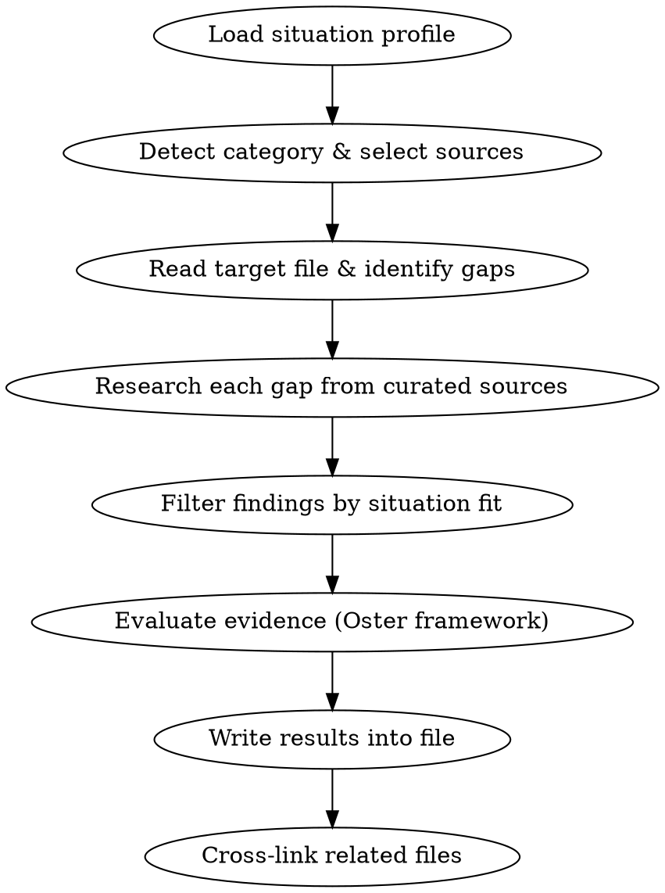

# Baby Research

Evidence-based research using curated trusted sources, filtered through the user's specific situation and evaluated with Emily Oster's framework.

## The Process



## Step 1: Load Situation Profile

Read the project's `CLAUDE.md` to extract the user's profile, constraints, and preferences. Then read the target file for any "Our Situation" or "Our Requirements" sections. **Nothing is hardcoded** — everything comes from the project files at runtime.

Build a situation filter from what you find. Common constraint types:
- Living space (apartment, house, dedicated nursery or not)
- Transport mode (car, transit, walking, combination)
- Pets (safety considerations for sleep surfaces, gear storage)
- Budget level (moderate, flexible, tight)
- Timeline/season (due date, birth season affects gear needs)
- Location type (urban, suburban, rural)

## Step 2: Detect Category & Select Sources

Determine the file's category from its path and prioritize sources accordingly. **REQUIRED:** Read `references/sources.md` for the full curated source list with search query patterns.

| Path prefix | Category | Primary sources |
|-------------|----------|-----------------|
| `02-gear/` | Gear | Consumer Reports, Wirecutter, NHTSA, CPSC, BabyGearLab, Car Seat Lady |
| `07-health/` | Health & Safety | AAP, Cochrane Reviews, CDC, ACOG, Zero to Three, LactMed |
| `06-feeding/` | Feeding | AAP, ABM, KellyMom, LactMed, FARE, Solid Starts |
| `05-childcare/` | Childcare | Emily Oster, NICHD Study, AAP, NAEYC, Cochrane |
| `01-pregnancy/` | Pregnancy | ACOG, AAP, Cochrane, Emily Oster |
| `04-birth-prep/` | Birth Prep | ACOG, AAP, Cochrane |
| `08-parental-leave/` | Leave | DOL/FMLA, state-specific resources |
| Other | General | AAP, Emily Oster, Cochrane |

## Step 3: Read Target File & Identify Gaps

Read the file completely. Identify:
- Empty tables (rows with `| | | |`)
- Placeholder text (`*Add research findings here*`, `TBD`, `___`)
- Missing options in comparison tables
- Unfilled sections or questions without answers
- Sections that exist but lack sources or evidence flags

**Preserve ALL existing content.** Append, don't overwrite. Use `*Updated YYYY-MM-DD:*` for additions.

## Step 4: Research Each Gap

**You MUST use WebSearch and WebFetch.** Do not fall back to training data without trying live search first.

For each gap, search curated sources using site-specific queries. See `references/sources.md` for query patterns per source.

```
Search order:
1. Site-specific searches for category's primary sources
2. General searches scoped to the topic
3. Cross-reference findings across 2+ sources when possible
```

**If WebSearch/WebFetch fail or are unavailable:** Use training data BUT add an explicit disclaimer: `*Note: Based on training data (cutoff [date]). Verify current prices, availability, and any recalls before purchase.*` Do NOT silently present training data as current research.

### Source Discipline

**USE:** Sources listed in `references/sources.md` — these have transparent methodology and editorial independence.

**DO NOT USE as sources:**
- Reddit, parenting forums, or social media
- Affiliate-heavy review sites (not Wirecutter/BabyGearLab which are in the curated list)
- Mommy blogs, influencer content
- Fear-based or alarmist health sites
- Manufacturer marketing materials (use for specs only, not claims)

If you encounter useful information from a non-curated source, flag it explicitly: `*Anecdotal:*` or `*Unverified source:*`

### Perishable Facts (Prices, Inventory, Policies)

Prices, retailer inventory (what a store carries), discount exclusions, and return policies change without notice. These are **perishable facts** — treat them differently from stable facts like product specs or safety standards.

- **Verify before writing:** Check the retailer's own website before stating what they carry, exclude, price, or allow
- **Cite with date:** `(Verified: [source](url), YYYY-MM-DD)` — the date matters because these facts expire
- **If verification fails:** Flag it: `*Unverified — check [retailer website] before acting on this*`
- **Cost comparisons:** Verify the current price at the specific retailer being discussed, not just MSRP
- **Never assume** a retailer carries a brand, or that a discount applies/excludes a brand, based on general knowledge — check the site

## Step 5: Filter Findings by Situation Fit

This is the most important step. **REQUIRED:** Read `references/situation-filtering.md` for detailed guidance.

For every option or recommendation found, evaluate fit against the situation profile from Step 1. Do NOT just report generic rankings.

**Every comparison table MUST include a Situation Fit column** rated: `Excellent` / `Good` / `Fair` / `Poor` with a brief reason.

Example:
```
| Model | Price | Weight | ... | Situation Fit |
|-------|-------|--------|-----|---------------|
| Chicco KeyFit 35 | $220 | 9.6 lb | ... | **Good** — affordable, moderate weight for transit |
| Nuna PIPA lite r | $400 | 5.5 lb | ... | **Excellent** — lightest option, ideal for transit; over budget |
| UPPAbaby Mesa Max | $520 | 12.5 lb | ... | **Poor** — heavy for transit, over budget |
```

Rank options by situation fit first, generic review score second. A 4.2-rated product that fits perfectly outranks a 4.8 that doesn't.

When no option perfectly fits, present the least-bad options with clear notes on compromises.

### Include Category Leaders

Every comparison table MUST include the category's top-rated or most-reviewed option from curated sources (e.g., BabyGearLab's #1, Wirecutter's top pick), even if it appears above budget or is not the obvious recommendation. This ensures the user sees the explicit tradeoff between the pick and the best-in-class option.

- If the category leader IS the recommendation, no extra work needed
- If the category leader is NOT the recommendation, the table must show why: "better product but $X more, and here's what you get for that $X"
- An above-budget category leader with **Excellent** situation fit is a signal to reconsider, not to exclude
- Budget items that beat category leaders on situation fit should say so explicitly: "Recommended over [leader] because [specific reason], despite [leader]'s advantage in [specific area]"

## Step 6: Evaluate Evidence (Oster Framework)

**REQUIRED:** Read `references/oster-framework.md` for detailed guidance and examples.

For every safety or health claim, apply this framework:

1. **What does the actual evidence say?** Not marketing. Not fear. Studies and data.
2. **How strong is the evidence?** RCTs > systematic reviews > observational > expert opinion > anecdotal. Be explicit.
3. **What are the real numbers?** Quantify with absolute risk when data exists. "50% reduction" means nothing without the baseline rate.
4. **Where is evidence genuinely mixed?** Say so. Don't manufacture consensus.
5. **What would Oster say?** For safety topics: what's the actual measured risk, how does it compare to baseline risks people already accept, and what's the cost of mitigation?

**For gear safety specifically:** All US car seats pass the same federal crash test (FMVSS 213). The marginal safety difference between a $170 and $500 seat is near-zero. The real safety lever is correct installation. Say this explicitly when relevant — don't let price imply safety.

## Step 7: Write Results Into File

Follow project conventions from CLAUDE.md:

- **Citations:** `(Source: [Name](url))` inline
- **Evidence flags:** `*Evidence:*` / `*Opinion:*` / `*Anecdotal:*` before claims
- **Date stamps:** `*Added YYYY-MM-DD*` on new sections
- **Tables:** Include Situation Fit column in all comparison tables
- **Blockquotes:** `> Key takeaway` for important findings and partner discussion prompts
- **Our Situation section:** How findings map to this user's specific constraints

Append to existing sections. Do not delete or rewrite content that's already good.

### Recommendations Must Survive Propagation

Recommendations in this project get referenced from multiple files (e.g., a mattress pick in crib-bassinet.md appears in registry-strategy.md and essentials.md). Write recommendations so the reasoning survives copy-paste:

- **State the tradeoff explicitly in the recommendation itself**, not just in the comparison table above it: "Recommended over [alternative] because [reason]; [alternative] is better at [X] but costs $Y more"
- **Never use relative qualifiers without context**: "Best breathability" must specify "best breathability among options under $X" or "best breathability in this comparison" — not unqualified superlatives that imply category-wide claims
- **When a recommendation is referenced in another file**, include a link back to the full comparison: "See [full comparison](../path/to/file.md#section)" so readers can trace the reasoning

## Step 8: Cross-Link Related Files

When research reveals connections to other files:
- Add cross-links: `See [related topic](../path/to/file.md)`
- Note dependencies: "Car seat choice affects stroller compatibility — see [stroller](stroller.md)"
- If a finding in one file should update another, note it: `*Note: This finding affects [other file] — update needed.*`
- When referencing a recommendation from another file, **preserve the key caveat or tradeoff** — don't flatten "best in-budget breathability (Newton is better but $100 more)" into just "best breathability"

## Batch Mode

When asked to research multiple files:
- Work through files sequentially or ask for parallel agent dispatch
- Each file gets the full process (Steps 1-8)
- Cross-link between files in the batch especially

## Red Flags — STOP If You Notice These

- You're citing a source not in `references/sources.md` without flagging it
- You're reporting generic rankings without situation filtering
- You're stating safety claims without evidence quality flags
- You're using training data without disclosing it
- You're overwriting existing file content instead of appending
- You're skipping the Situation Fit column in a comparison table
- You're presenting relative risk without absolute numbers
- You're stating retailer inventory, prices, or discount exclusions without live verification
- You're building a comparison table without the category's top-rated option from curated sources
- You're writing an unqualified superlative ("best X") without specifying the scope
- You're referencing a recommendation in another file without preserving its caveats or linking back
